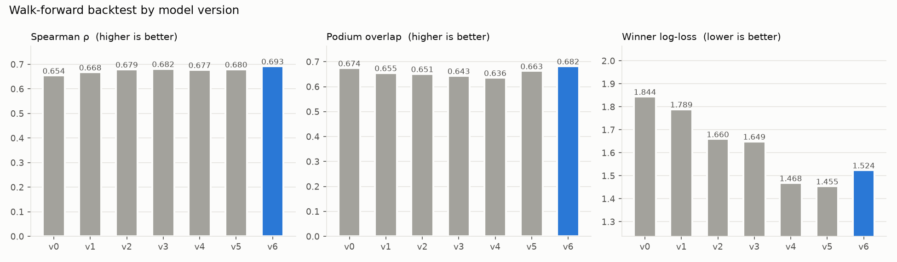
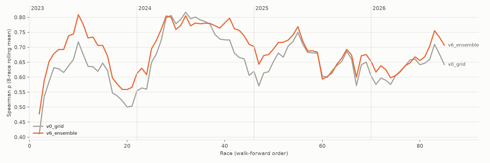
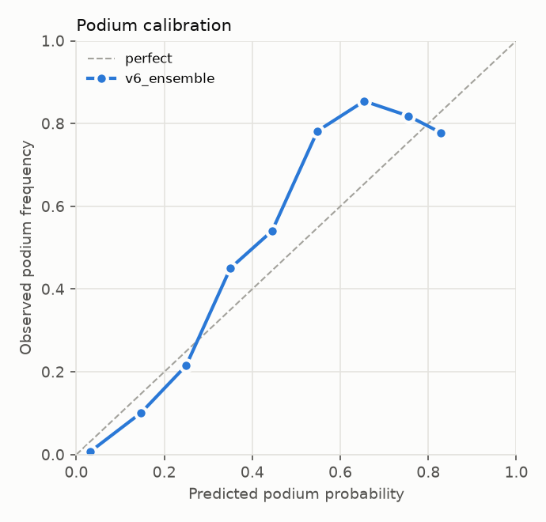
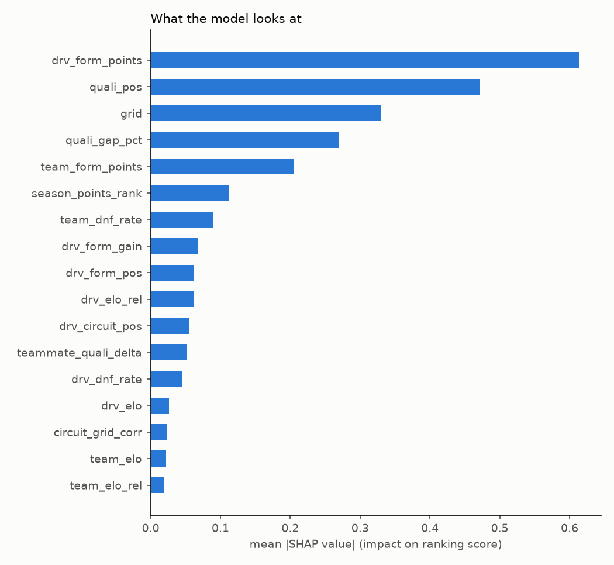
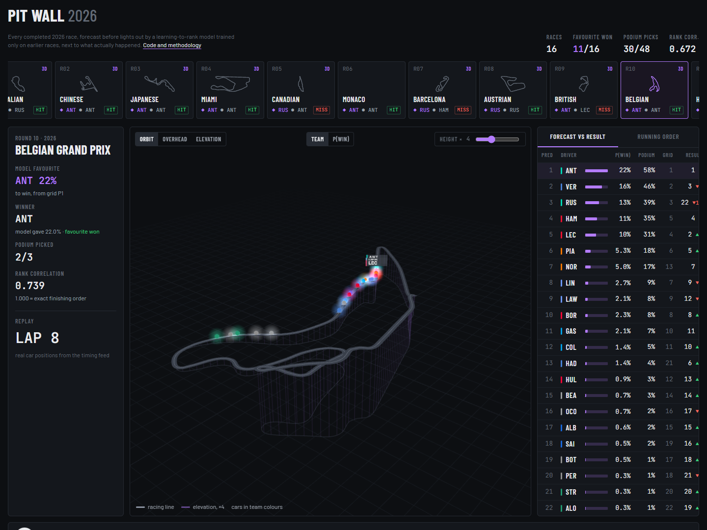

# F1 Race Predictions

Probabilistic Formula 1 race forecasting: **learning-to-rank on leakage-free
features, turned into win/podium/points probabilities by Plackett-Luce Monte Carlo
simulation**, evaluated with a race-by-race walk-forward backtest over 86 Grands
Prix (2023 to 2026).


**Live: [Pit Wall 2026](https://siddhant-shankar.github.io/F1_PREDICTIONS/)**, every 2026 race's
forecast against the result, with a 3D replay built from the timing feed.

```
$ python -m f1pred predict 2025 9

| Pred | Driver | Team     | Grid | P(win) | P(podium) | P(points) | E[pos] | Actual |
|   1  | PIA    | McLaren  |   1  | 32.1%  |   76.0%   |  100.0%   |  2.5   |   1    |
|   2  | NOR    | McLaren  |   2  | 24.3%  |   66.2%   |  100.0%   |  3.0   |   2    |
|   3  | VER    | Red Bull |   3  | 12.0%  |   41.9%   |   99.3%   |  4.2   |  10    |
...
```

## Results

Every race below was predicted using **only data available before that race**:
train on all earlier races, predict, then score against the real result.

<!-- leaderboard:start -->
| Model | Races | Spearman ρ ↑ | NDCG@10 ↑ | Winner hit-rate ↑ | Podium overlap ↑ | Points (top-10) overlap ↑ | MAE (positions) ↓ | Winner log-loss ↓ | Podium Brier ↓ |
|---|---:|---:|---:|---:|---:|---:|---:|---:|---:|
| `v0_grid` | 86 | 0.654 | 0.891 | 0.605 | 0.674 | 0.777 | 3.358 | 1.844 | 0.078 |
| `v1_quali_linear` | 86 | 0.668 | 0.892 | 0.628 | 0.655 | 0.784 | 3.302 | 1.789 | 0.078 |
| `v2_form_gbm` | 86 | 0.679 | 0.897 | 0.651 | 0.651 | 0.791 | 3.245 | 1.660 | 0.075 |
| `v3_elo_gbm` | 86 | 0.682 | 0.896 | 0.605 | 0.643 | 0.786 | 3.267 | 1.649 | 0.075 |
| `v4_lambdarank` | 86 | 0.677 | 0.896 | 0.581 | 0.636 | 0.793 | 3.304 | 1.468 | 0.074 |
| `v5_rank_finishers` | 86 | 0.680 | 0.897 | 0.663 | 0.663 | 0.792 | 3.232 | 1.455 | 0.072 |
| `v6_ensemble` | 86 | 0.693 | 0.902 | 0.663 | 0.682 | 0.798 | 3.170 | 1.524 | 0.071 |
<!-- leaderboard:end -->



- **The starting grid is a strong baseline.** The pole-sitter wins about 60% of
  the time. The final ensemble beats it on all eight metrics.
- **Probabilities improve most.** Winner log-loss falls 17 to 21% (v5/v6 vs
  grid), so the model assigns much more probability to the driver who actually
  wins, even when it doesn't name them as favourite.
- **Training only on classified finishers** (`v4` to `v5`) was the single
  biggest step for winner and podium accuracy. A car that retires with a gearbox
  failure tells you nothing about its pace, and fitting that noise hurt the
  ranker.



| Podium calibration | What the model uses (SHAP) |
|---|---|
|  |  |

Race-by-race forecast reports for the 2025 season, each made with the model
version that existed at the time, are in [`predictions/2025`](predictions/2025).

## Pit Wall: the 2026 season in 3D

[](https://siddhant-shankar.github.io/F1_PREDICTIONS/replay/)

**[Open Pit Wall](https://siddhant-shankar.github.io/F1_PREDICTIONS/)** (static site on GitHub Pages)

- **Landing page:** the latest race's forecast against its result, a ledger of every 2026
  call, the misses ranked by how surprised the model was, and a line drawing of the 2026 car.
  The replay app lives at [`/replay/`](https://siddhant-shankar.github.io/F1_PREDICTIONS/replay/).
- **Season rail:** every completed 2026 race with its circuit outline, the model's favourite
  (◆) against the winner (●), and whether the call was right.
- **3D replay:** the circuit is rebuilt from the timing feed's X/Y/Z positions, with the
  height exaggerated (adjustable) so Eau Rouge and Suzuka's crossover read clearly. All 22 cars
  replay the race at 8× to 90×, and can be coloured by team or by the model's P(win).
- **Timing tower:** forecast against result, or the running order lap by lap against each
  driver's predicted position.

Built with Vite + TypeScript + three.js. `python -m f1pred export-web` writes the data as
static JSON (about 600 KB per race), and a GitHub Actions workflow builds and deploys `web/` on
every push. Monaco has no replay because the timing feed has no car positions for that race.

```bash
python -m f1pred export-web --season 2026   # forecasts + replays -> web/public/data
cd web && npm ci && npm run dev             # http://localhost:5173
```

## How it works

```
 FastF1 / Jolpica ──► results.parquet ──► leakage-free features ──► ranker score ──► Plackett-Luce ──► P(win), P(podium), ...
  (2022 to now)       one row per          quali pace, EWMA form,     LightGBM          Monte Carlo
                      driver per race      Elo, circuit history       LambdaRank        T fit out-of-sample
```

1. **Data.** Every race and qualifying result since the 2022 regulation reset,
   pulled through FastF1's Jolpica (Ergast) interface.
2. **Features.** Qualifying gap to pole (%) and to the teammate; exponentially
   weighted driver and team form; multi-competitor **Elo ratings** that shrink
   toward the mean between seasons (harder on regulation resets); circuit
   history, including how much the grid order usually decides the race at that
   track. Every rolling feature is lagged, and a unit test proves that changing a
   race's result cannot change any feature up to and including that race.
3. **Ranking.** LightGBM **LambdaRank** optimises the in-race ordering (NDCG)
   directly, instead of per-driver position error. The final model blends it
   with a regressor and the grid.
4. **Probabilities.** Scores become a **Plackett-Luce** distribution over
   finishing orders. Its temperature is fitted by maximum likelihood on earlier
   out-of-sample predictions, and 10,000 races are simulated with the
   Gumbel-max trick.

See **[docs/METHODOLOGY.md](docs/METHODOLOGY.md)** for the details: the Elo
update, why learning to rank, the Plackett-Luce maths, metrics, and limitations.

## Quickstart

```bash
pip install -e ".[dev,explain,app]"

python -m f1pred ingest              # download 2022 to present (~50 HTTP requests, cached)
python -m f1pred backtest            # walk-forward backtest of every model version
python -m f1pred predict 2026 16     # forecast a race and write a markdown report
python -m f1pred explain             # SHAP feature importance
streamlit run app/streamlit_app.py   # interactive backtest explorer
pytest                               # offline test suite (synthetic data)
```

### Dashboard

`streamlit run app/streamlit_app.py` opens an interactive explorer with three
tabs: any backtested race (probabilities against the result), the model-version
leaderboard, and accuracy race by race. It reads the committed backtest output,
so it needs only `app/requirements.txt` and deploys as-is on
[Streamlit Community Cloud](https://share.streamlit.io) with
`app/streamlit_app.py` as the entrypoint.

## Project layout

```
f1pred/
  data/ingest.py          FastF1/Jolpica download, one tidy results table
  features/build.py       leakage-free feature engineering
  features/elo.py         multi-competitor Elo for drivers and constructors
  models/zoo.py           model versions v0 to v6, one shared interface
  models/plackett_luce.py likelihood, temperature fit, Gumbel-max simulation
  evaluation/backtest.py  walk-forward backtest
  evaluation/metrics.py   ranking and probability metrics
  evaluation/report.py    leaderboard and figures
  predict.py              single-race forecast and race report
  explain.py              SHAP explanations
  export.py               static JSON for the web app (forecasts, track geometry, replays)
app/streamlit_app.py      dashboard (Streamlit Community Cloud ready)
web/                      Pit Wall: Vite + TypeScript + three.js, deployed to GitHub Pages
  src/scene.ts            3D circuit, cars, cameras, picking
  src/main.ts             season rail, timing tower, replay clock, controls
tests/                    leakage, simulation, metric, and backtest tests
legacy/                   the original single-race scripts this project grew from
```

## Limitations and next steps

- No weather, tyre-strategy, or practice long-run pace features yet. Wet races
  are the largest source of error.
- The 2026 regulation reset means early-season team form carries little
  information. A hierarchical prior on new-era car performance would help.
- Podium probabilities are slightly under-confident in the 30 to 60% range (see
  the calibration plot). Isotonic recalibration on top of Plackett-Luce is a
  natural next step.
